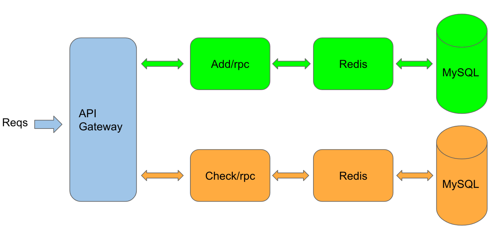
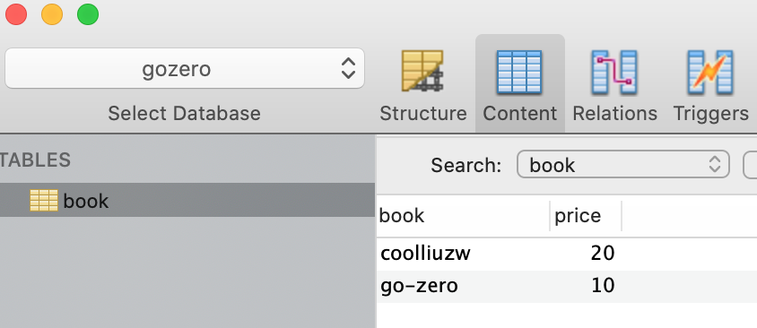

<!--more-->

>  [官方教程](https://www.yuque.com/tal-tech/go-zero/rm435c#6bc775e9)

## 简述

- go-zero的微服务的框架，从开源就开始关注了，当时自己才刚入门Go语言，对一些微服务的策略都没有什么概念。
- 目前对Go语言有了基本的了解，准备看官方文档对Go较深度的学习一下。

- 按照官方的实例。包括相关环境的安装教程。

## 开始

### 书店微服务框架架构图



### 环境安装

- 后期环境的安装，尽量使用docker的方式实现

#### redis环境安装

**查询redis列表**

`docker search redis`

**拉取最新版本**

`docker pull redis:latest`

**查看redis镜像**

`docker images | grep redis`

**开始运行redis**

`docker run -itd --name  redis -p 6379:6379 redis`

**查看是否运行成功**

`docker ps -a | grep redis`

**使用通过redis-cli连接测试使用redis服务**

`docker exec -it redis-test /bin/bash`

`redis-cli`

`ping`

`shutdown` 退出 docker-cli

再使用exit退出

[Linux环境使用Docker安装Redis以及初步使用](https://blog.csdn.net/weixin_42119415/article/details/103270972)

#### etcd环境安装

`docker pull gcr.io/etcd-development/etcd:v3.4.14`

`docker pull quay.io/coreos/etcd:v3.4.14`

```bash
$ rm -rf /tmp/etcd-data.tmp && mkdir -p /tmp/etcd-data.tmp && \
  docker rmi quay.io/coreos/etcd:v3.4.14 || true && \
  docker run \
  -p 2379:2379 \
  -p 2380:2380 \
  --mount type=bind,source=/tmp/etcd-data.tmp,destination=/etcd-data \
  --name etcd-gcr-v3.4.14 \
  quay.io/coreos/etcd:v3.4.14 \
  /usr/local/bin/etcd \
  --name s1 \
  --data-dir /etcd-data \
  --listen-client-urls http://0.0.0.0:2379 \
  --advertise-client-urls http://0.0.0.0:2379 \
  --listen-peer-urls http://0.0.0.0:2380 \
  --initial-advertise-peer-urls http://0.0.0.0:2380 \
  --initial-cluster s1=http://0.0.0.0:2380 \
  --initial-cluster-token tkn \
  --initial-cluster-state new \
  --log-level info \
  --logger zap \
  --log-outputs stderr
  
 
 // 测试
  docker exec etcd-gcr-v3.4.14 /bin/sh -c "/usr/local/bin/etcd --version"
docker exec etcd-gcr-v3.4.14 /bin/sh -c "/usr/local/bin/etcdctl version"
docker exec etcd-gcr-v3.4.14 /bin/sh -c "/usr/local/bin/etcdctl endpoint health"
docker exec etcd-gcr-v3.4.14 /bin/sh -c "/usr/local/bin/etcdctl put foo bar"
docker exec etcd-gcr-v3.4.14 /bin/sh -c "/usr/local/bin/etcdctl get foo"
```

#### mysql环境安装

```bash
# 下载Mysql 5.7 镜像
$ docker pull mysql:5.7

$ mkdir /Users/liuzhiwei/code/mysql/{conf,logs,mysql}

$ docker run -d -p 3306:3306 --name mysql \
-v /Users/liuzhiwei/code/mysql/conf:/etc/mysql \
-v /Users/liuzhiwei/code/mysql/logs:/var/log/mysql \
-v /Users/liuzhiwei/code/mysql/data:/var/lib/mysql \
-e MYSQL_ROOT_PASSWORD=admin \
mysql:5.7
bb61d23735223052f1c4b731bd2710be01a9b60d0ec8bff899752470a2f6ba73
```

- 安装etcd, mysql, redis
- 安装`protoc-gen-go`

```
go get -u github.com/golang/protobuf/protoc-gen-go
```

- 安装goctl工具

```
GO111MODULE=on GOPROXY=https://goproxy.cn/,direct go get -u github.com/tal-tech/go-zero/tools/goctl
```

### 创建测试项目

- 按照文档测试就ok

- 注意rpc服务的配置文件

  `DataSource: root:admin@tcp(localhost:3306)/gozero`

- MySQL的数据库的表的话，自己手动去创建就好了。



## 总结

- 环境搭建好，最好还是测试成功了，MySQL没有白入门，哈哈。
- `go-zero`确实有点强，基础的几行代码就能实现一个高并发的微服务，使用到`redis`和`MySQL`和`etcd`三个服务，搭建都是使用`docker`的方式。