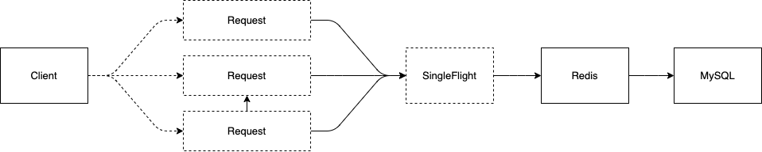

<!--more-->


## 1 简介

项目开发的过程中，为了提高服务的并发能力，缓存是其中一个重要的方法，合理和缓存数据可以显著的提高服务的并发能力。

用SingleFlight合并重复请求，singleflight包提供了一种抑制重复函数调用的机制。

具体到`Go`程序运行的层面来说，`SingleFlight`的作用是在处理多个`goroutine`同时调用同一个函数的时候，只让一个`goroutine`去实际调用这个函数，等到这个`goroutine`返回结果的时候，再把结果返回给其他几个同时调用了相同函数的`goroutine`，这样可以减少并发调用的数量。在实际应用中也是，它能够在一个服务中减少对下游的并发重复请求。还有一个比较常见的使用场景是用来**防止缓存击穿**。

## 2 缓存击穿

### 2.1 什么是缓存击穿

- 缓存击穿是指缓存中没有但数据库中有的数据（未缓存或者缓存到期），这时由于并发用户特别多，同时读缓存没读到数据，又同时去数据库去取数据，引起数据库压力瞬间增大，造成过大压力 。简单地说就是`缓存过期大量线程访问数据库`。

- key对应的数据在数据源并不存在，每次针对此key的请求从缓存获取不到，请求都会到数据源，从而可能压垮数据源。比如用一个不存在的用户id获取用户信息，不论缓存还是数据库都没有，若黑客利用此漏洞进行攻击可能压垮数据库。

### 2.2 常见的解决方案

造成缓存穿透的**原因**有两点：

- 缓存过期
- 大量链接访问数据库

常见解决方法：

1. 设置热点数据永远不过期
2. 分级缓存
3. 加锁

### 2.3 缓存处理流程

当缓存失效时，需要去数据存储层获取数据，然后存储到缓存中。

通常缓存更新方案：

1. 业务代码中，根据key从缓存拿不到数据，访问存储层获取数据后更新缓存
2. 由专门的定时脚本在缓存失效前对其进行更新
3. 通过分布式锁，实现只有一个请求负责缓存更新，其他请求等待。

## 3 Go singleflight

### 3.1 Go singleflight的使用

`$ go get -u golang.org/x/sync/singleflight`

```go
package main

import (
	"log"
	"sync"
	"time"

	"golang.org/x/sync/singleflight"
)

func main() {
	var singleSetCache singleflight.Group

	var wg sync.WaitGroup
	cacheKey := "cacheKey"
	for i := 0; i < 10; i++ {
		wg.Add(1)
		go func(i int) {
			defer wg.Done()
			value, err, shared := singleSetCache.Do(cacheKey, func() (ret interface{}, err error) { //do的入参key，可以直接使用缓存的key，这样同一个缓存，只有一个协程会去读DB
				log.Printf("%v exec", i)
				time.Sleep(3 * time.Second)
				return "value", nil
			})
			log.Printf("value %v, err %v, shared:%v", value.(string), err, shared)
		}(i)
	}
	wg.Wait()
}
```

- 输出

```bash
2021/01/05 23:18:32 0 exec
2021/01/05 23:18:35 value value, err <nil>, shared:true
2021/01/05 23:18:35 value value, err <nil>, shared:true
2021/01/05 23:18:35 value value, err <nil>, shared:true
2021/01/05 23:18:35 value value, err <nil>, shared:true
2021/01/05 23:18:35 value value, err <nil>, shared:true
2021/01/05 23:18:35 value value, err <nil>, shared:true
2021/01/05 23:18:35 value value, err <nil>, shared:true
2021/01/05 23:18:35 value value, err <nil>, shared:true
2021/01/05 23:18:35 value value, err <nil>, shared:true
2021/01/05 23:18:35 value value, err <nil>, shared:true
```

### 3.2 Go singleflight的源码分析

`Go`扩展库里用`singleflight.Group`结构体类型提供了`SingleFlight`并发原语的功能。

`singleflight.Group`类型提供了三个方法：

```go
func (g *Group) Do(key string, fn func() (interface{}, error)) (v interface{}, err error, shared bool)

func (g *Group) DoChan(key string, fn func() (interface{}, error)) <-chan Result

func (g *Group) Forget(key string)
```

- **Do**方法，接受一个字符串Key和一个待调用的函数，会返回调用函数的结果和错误。使用Do方法的时候，它会根据提供的Key判断是否去真正调用`fn`函数。同一个 key，在同一时间只有第一次调用Do方法时才会去执行`fn`函数，其他并发的请求会等待调用的执行结果。
- **DoChan**方法：类似Do方法，只不过是一个异步调用。它会返回一个通道，等`fn`函数执行完，产生了结果以后，就能从这个 chan 中接收这个结果。
- **Forget**方法：在SingleFlight中删除一个Key。这样一来，之后这个Key的Do方法调用会执行`fn`函数，而不是等待前一个未完成的`fn` 函数的结果。

## 4 应用场景

了解了Go语言提供的 SingleFlight并发原语都有哪些方法可以调用后 ，下面介绍两个它的应用场景。

### 4.1 查询DNS记录

Go`语言的`net`标准库里使用的`lookupGroup`结构，就是Go扩展库提供的原语`singleflight.Group

```go
type Resolver struct {
  ......
 // 源码地址 https://github.com/golang/go/blob/master/src/net/lookup.go#L151
 // lookupGroup merges LookupIPAddr calls together for lookups for the same
 // host. The lookupGroup key is the LookupIPAddr.host argument.
 // The return values are ([]IPAddr, error).
 lookupGroup singleflight.Group
}
```

它的作用是将对相同域名的DNS记录查询合并成一个查询，下面是`net`库提供的DNS记录查询方法`LookupIp`使用`lookupGroup`这个SingleFlight进行合并查询的相关源码，它使用的是异步查询的方法`DoChan`。

```go
func LookupIP(host string) ([]IP, error) {
 addrs, err := DefaultResolver.LookupIPAddr(context.Background(), host)
  ......
}

func (r *Resolver) lookupIPAddr(ctx context.Context, network, host string) ([]IPAddr, error) {
  ......
  // 使用SingleFlight的DoChan合并多个查询请求
 ch, called := r.getLookupGroup().DoChan(lookupKey, func() (interface{}, error) {
  defer dnsWaitGroup.Done()
  return testHookLookupIP(lookupGroupCtx, resolverFunc, network, host)
 })
 if !called {
  dnsWaitGroup.Done()
 }
 
 select {
 case <-ctx.Done():
  ......
 case r := <-ch:
  lookupGroupCancel()
  if trace != nil && trace.DNSDone != nil {
   addrs, _ := r.Val.([]IPAddr)
   trace.DNSDone(ipAddrsEface(addrs), r.Shared, r.Err)
  }
  return lookupIPReturn(r.Val, r.Err, r.Shared)
 }
}
```

上面的源码做了很多删减，只留了`SingleFlight`合并查询的部分，如果有兴趣可以去`GitHub`上看一下完整的源码，访问链接https://github.com/golang/go/blob/master/src/net/lookup.go#L261 ，可直接定位到这部分的源码。

### 4.2 防止缓存击穿

在项目里使用缓存时，一个常见的用法是查询一个数据先去查询缓存，如果没有就去数据库里查到数据并缓存到`Redis`里。那么缓存击穿问题是指，高并发的系统中，大量的请求同时查询一个缓存Key 时，如果这个 Key 正好过期失效，就会导致大量的请求都打到数据库上，这就是缓存击穿。用 `SingleFlight` 来解决缓存击穿问题再合适不过，这个时候只要这些对同一个 Key 的并发请求的其中一个到数据库中查询就可以了，这些并发的请求可以共享同一个结果。

下面是一个模拟用`SingleFlight`并发原语合并查询`Redis`缓存的程序，你可以自己动手测试一下，开10个`goroutine`去查询一个固定的Key，观察一下返回结果就会发现最终只执行了一次`Redis`查询。

```go
// 模拟一个Redis客户端
type client struct {
  // ... 其他的配置省略
  requestGroup singleflight.Group
}

// 普通查询
func (c *client) Get(key string) (interface{}, error) {
  fmt.Println("Querying Database")
  time.Sleep(time.Second)
  v := "Content of key" + key
  return  v, nil
}

// SingleFlight查询
func (c *client) SingleFlightGet(key string) (interface{}, error) {
  v, err, _ := c.requestGroup.Do(key, func() (interface{}, error) {
    return c.Get(key)

  })
  if err != nil {
    return nil, err
  }
  return v, err
}
```

> 完整的测试源码可以点击阅读原文，去我的GitHub仓库下载

## 5 实现原理

最后我们来看一下`singleflight.Group`的实现原理，通过它的源码也是能学到不少用`Go`语言编程的技巧的。`singleflight.Group`由一个互斥锁`sync.Mutex`和一个映射表组成，每一个 `singleflight.call`结构体都保存了当前调用对应的信息：

```go
type Group struct {
  mu sync.Mutex
  m  map[string]*call
}

type call struct {
  wg sync.WaitGroup

  val interface{}
  err error

  dups  int
  chans []chan<- Result
}
```

下面我们来看看 Do 和 DoChan 方法是怎么实现的。

### 5.1 Do方法

`SingleFlight` 定义一个`call`结构体，每个结构体都保存了`fn`调用对应的信息。

Do方法的执行逻辑是每次调用Do方法都会先去获取互斥锁，随后判断在映射表里是否已经有Key对应的`fn`函数调用信息的`call`结构体。

- 当不存在时，证明是这个Key的第一次请求，那么会初始化一个`call`结构体指针，增加`SingleFlight`内部持有的`sync.WaitGroup`计数器到1。释放互斥锁，然后阻塞的等待doCall方法执行`fn`函数的返回结果
- 当存在时，增加`call`结构体内代表`fn`重复调用次数的计数器`dups`，释放互斥锁，然后使用`WaitGroup`等待`fn`函数执行完成。

`call`结构体的`val` 和 `err` 两个字段只会在 `doCall`方法中执行`fn`有返回结果后才赋值，所以当 `doCall`方法 和 `WaitGroup.Wait`返回时，函数调用的结果和错误会返回给Do方法的所有调用者。

```go
func (g *Group) Do(key string, fn func() (interface{}, error)) (v interface{}, err error, shared bool) {
  g.mu.Lock()
  if g.m == nil {
    g.m = make(map[string]*call)
  }
  if c, ok := g.m[key]; ok {
    // 存在相同的key, 增加计数
    c.dups++
    g.mu.Unlock()
    c.wg.Wait() //等待这个key对应的fn调用完成
    return c.val, c.err, true // 返回fn调用的结果
  }
  c := new(call) // 不存在key, 是第一个请求, 创建一个call结构体
  c.wg.Add(1)
  g.m[key] = c //加入到映射表中
  g.mu.Unlock()


  g.doCall(c, key, fn) // 调用方法
  return c.val, c.err, c.dups > 0
}
```

`doCall`方法会去实际调用`fn`函数，因为`call`结构体初始化后`forgotten`字段的默认值是`false`，`fn`调用有返回后，会把对应的Key删掉。这样这轮请求都返回后，下一轮使用同一的Key的请求会重新调用执行一次`fn`函数。

```go
func (g *Group) doCall(c *call, key string, fn func() (interface{}, error)) {
  c.val, c.err = fn()
  c.wg.Done()


  g.mu.Lock()
  if !c.forgotten { // 已调用完，删除这个key
    delete(g.m, key)
  }
  for _, ch := range c.chans {
    ch <- Result{c.val, c.err, c.dups > 0}
  }
  g.mu.Unlock()
}
```

### 5.2 DoChan方法

`SingleFlight`还提供了异步调用`DoChan`方法，它的执行逻辑和`Do`方法类似，唯一不同的是调用者不用阻塞等待调用的返回， `DoChan`方法会创建一个`chan Result`通道返回给调用者，调用者通过这个通道就能接受到`fn`函数的结果。这个`chan Result`通道，在返回给调用者前会先放到`call`结构体的维护的通知队列里，待`fn`函数返回结果后`DoChan`方法会把结果发送给通知队列中的每个通道。

```go
func (g *Group) DoChan(key string, fn func() (interface{}, error)) <-chan Result {
  ch := make(chan Result, 1)
  g.mu.Lock()
  if g.m == nil {
    g.m = make(map[string]*call)
  }
  if c, ok := g.m[key]; ok {
    c.dups++
    c.chans = append(c.chans, ch)
    g.mu.Unlock()
    return ch
  }
  c := &call{chans: []chan<- Result{ch}}
  c.wg.Add(1)s
  g.m[key] = c
  g.mu.Unlock()

  go g.doCall(c, key, fn)

  return ch
}

type Result struct {
  Val    interface{}
  Err    error
  Shared bool
}
```

## 6 总结

基本梳理了Go singleflight的使用方法及其代码的原理，代码及其的精炼，值得学习和分享代码的使用。

[]: <>

