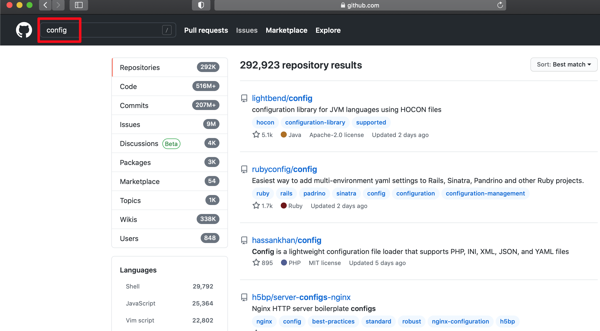
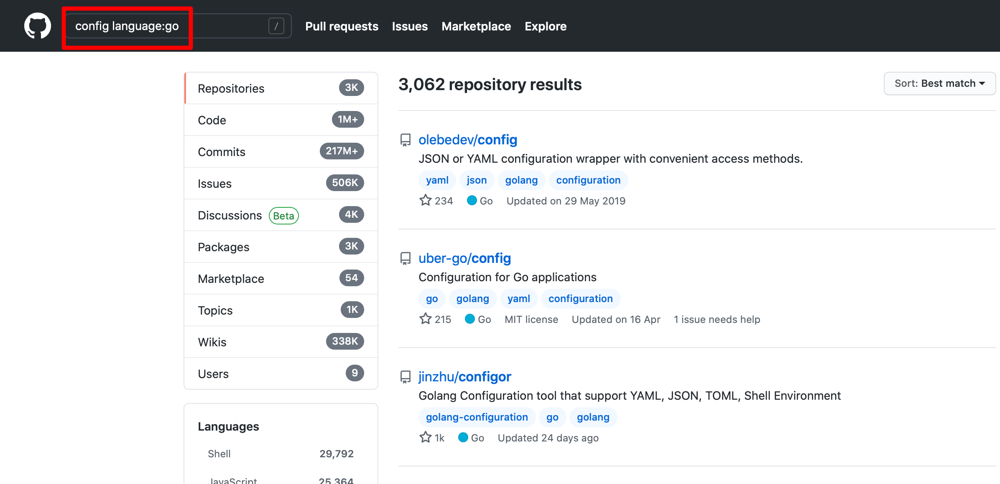
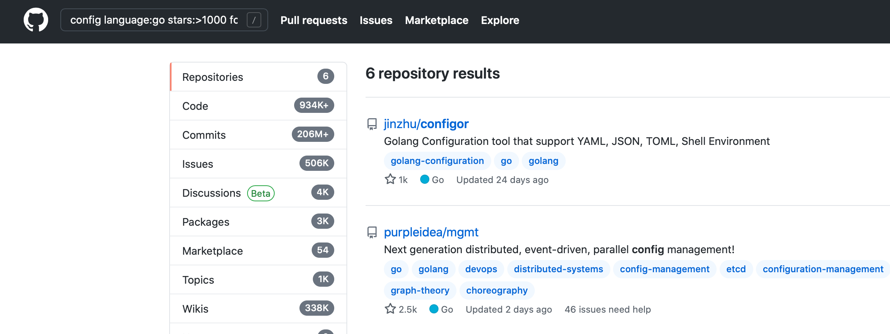

如何玩转GitHub的扩展篇，实战实战演练.

<!--more-->

## 简述

全球最大的同性交友平台，程序员必备知识。那么如果在Githu取到自己想要的项目呢？

## 开始

- 以获取一个 Go 语言的配置文件的库为例
  - 需求:
    - 支持加载local的config文件。
    - 支持YAML, JSON, TOML多种格式。
    - 最好支持同时获取环境变量的参数。

### 一步一步来时间

- 初级程序员:

  

直接使用查到`config`的方式，what？发现go语言的都没有。翻了好几页，特么也没有。

- 进阶程序员

  

  `config language:go` 筛选编程语言，这样基本可以找到一些热门，关键词准确的项目。

- 高级程序员

- 

  `config language:go stars:>1000 forks:>100 pushed:>2020-05-01`

  查找并伴随着一些标签信息。之前文章已经介绍过了。

  - **stars**：点赞人数，可以看出项目好坏的主要指标。
  - **forks**：项目的forks人数，基本可以看出来项目的维护人数，也是越多越好。
  - **pushed**：上次合并代码的时间，可以判断出项目是否很久没有人维护了。
  - 其他还有很多标签，具体可以参考官方文档。

## 总结

- 使用相关的参数，获取到精准的您所需要项目。快去试试吧。
- 后续会出一个如何获取您的语言近期热门的项目。