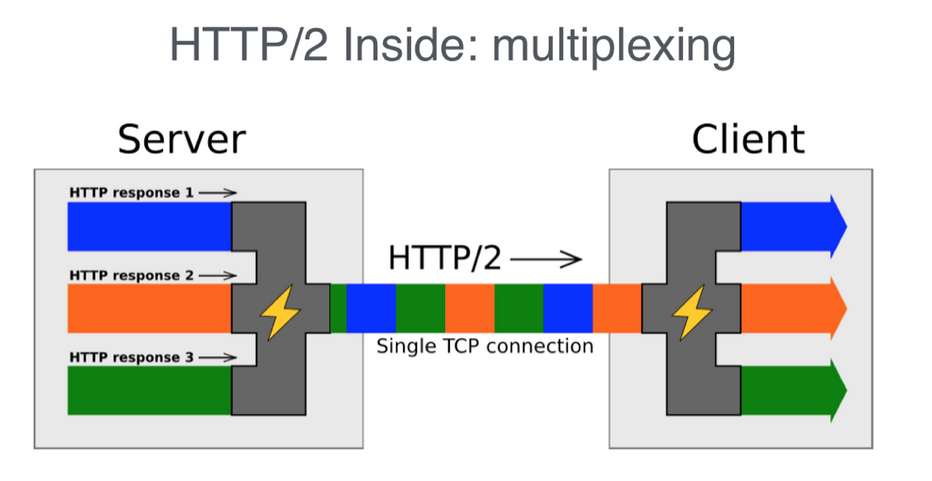

# 【http】聊聊无处不在的HTTP演进史

聊聊无处不在的HTTP演进史.

<!--more-->

## 简述

- HTTP，日常无论是开发还是生活中的浏览网页，可以说只要有联网基本就能接触到HTTP。今天来聊聊HTTP的演进史，HTTP1.0，HTTP1.1，HTTP2.0。
- **超文本传输协议**（HTTP）全名(hypertext transport protocol ：基本50%程序员都不知道，如果你知道你就比50%程序员优秀啦) 是用于传输诸如HTML的超媒体文档的应用层协议。
- 设计之初用于Web浏览器和Web服务器之间的通信，但它也可以用于其他目的。eg: 服务之间内部的请求。
- HTTP是无状态协议，这也是被大量应用主要的原因，有着很多好处，不过也有一定的缺点，比如：cookie/session 解决无状态的一种方法。尽管底层的TCP/IP层是有状态的，但是分层可以说，已经把它们完全隔离开。

## HTTP1.0

HTTP1.0时代，诞生时间，我出身的时候，1996年，基本弃用了。

影响一个 HTTP 网络请求的因素主要有两个：带宽和延迟

- **带宽**
- **延迟**：
  - **浏览器阻塞（HOL blocking）**
  - **DNS 查询（DNS Lookup）**
  - **建立连接（Initial connection）**：默认是使用短连接的方式.

## HTTP1.1

HTTP1.1时代，1999年，目前还是被大量的使用，HTTP1.1也是当前使用最为广泛的HTTP协议。近几年开始慢慢的有些大企业使用HTTP2的方式接入服务了。

区别:

- **缓存处理**
- **带宽优化及网络连接的使用**
- **错误通知的管理** ：新添加了24个错误原因码
- **Host头处理**
- **长连接**：核心改变，默认长连接的方式。如果特殊场景需要使用短连接的方式需要带上 `Connection： close`头域。
  - 扩展一个问题, HTTP1.1使用长连接的方式，是否需要或者说必要带,`Connection： keep-alive`?
    - 这个我也查阅了 `RFC`文档，没有提到，需要带上，所以说默认没带的情况，服务端需要人为是长连接。
    - go语言的net包、httpclient也是默认使用长连接的方式，官方是没有携带 keep-alive头域的。

## HTTPS

HTTP和HTTPS对比，简单的说一下。

- HTTPS是基于TLS之上，加密传输。
- HTTP是基于TCP之上，非加密传输。
- 简单的说:
  - 抓包HTTP可以抓到。
  - HTTP少了加密的过程，性能估计更强。
  - HTTPS使用加密协议，安全性更强。

- 具体其他想了解可以Google看看。

## HTTP2

### http2 新特性

​	● **新的二进制格式（Binary Format）**：HTTP1.x的解析是基于文本。HTTP2.0的协议解析决定采用二进制格式。

- **多路复用（MultiPlexing）**:共享连接，应该是解决HTTP1.x中`队头堵塞`的问题。
- 

● **header压缩**

● **服务端推送（server push）**

## HTTP3

目前基本没有使用，先不说。

## 总结

最近在项目，想对HTTP1.1和HTTP2.0做性能分析，学习相关基础知识对后续分析有一定帮助，后续也会出一个 Go HTTP1.1和HTTP2.0性能分析文档。

[comment]: <https://juejin.cn/post/6904423377499324423> "This is a comment, it will not be included"
[comment]: <https://juejin.cn/post/6844903559952089102> "This is a comment, it will not be included"
