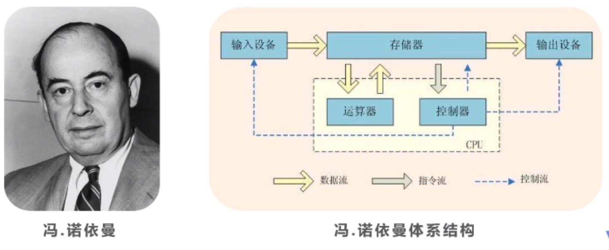

# 【人物】现代计算机之父 约翰·冯·诺依曼

<!--more-->

## 简述
  简单的介绍现在计算机之父、约翰·冯·诺依曼 和 冯·诺依曼体系结构

## 约翰·冯·诺依曼
  **冯·诺依曼**（John von Neumann，1903年12月28日-1957年2月8日），美籍匈牙利数学家、计算机科学家、物理学家，是20世纪最重要的数学家之一。冯·诺依曼是布达佩斯大学数学博士，是现代计算机、博弈论、核武器和生化武器等领域内的科学全才之一，被后人称为“**现代计算机之父**”、“**博弈论之父**”。

## 冯 · 若依曼体系结构

现代社会中所有电脑都是通过这个体系结构来建立的。所有电脑都是由输入设备（键盘、鼠标等），存储设备（内存条、硬盘等），运算设备（CPU、GPU），还有控制设备，去控制输出设备（显示器、摄像头等）这几种基本设备所构成。

计算机中的IO，指的是单词input输入和output输出，也就是计算机的输入输出。

